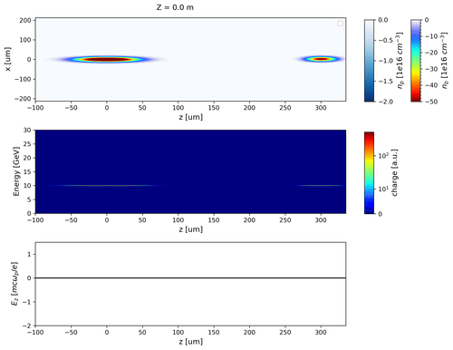

Single-stage beam-driven acceleration in quasi-3D cylindrical geometry (using QPAD)
===================================================================================

This page describes how to run a **single-stage beam-driven acceleration simulation in quasi-3D cylindrical geometry**,
using the quasi-static code `QPAD <https://github.com/tdalichaouch/QPAD/tree/conda-forge/>`_. 

For more details on the
features of QPAD and how it compare to other codes, see :doc:`../../validity_of_codes/index`.

Overview
--------

This example showcases the hosing instability in a two-bunch, single-stage PWFA with transverse offsets.
In this example, a narrow 3 nC drive bunch excites a plasma wakefield in the nonlinear blowout regime. A 1 nC trailing bunch behind the driver is initially offset transversely by 2 microns and undergoes hosing as the slice centroid oscillations grow. Both beams are tri-gaussian and the plasma density profile is longitudinally and transversely uniform. Some additional features of this example include:

- **Beam loading**: The witness bunch is positioned at the appropriate phase of the wake (~ 300 um behind the driver) so that it flattens the accelerating field near the beam center. This helps preserve the energy spread of the witness bunch.

- **Matching**: Beams are matched to the plasma so that their spot sizes do not oscillate. 

- **Quasi-3D Algorithm**: QPAD has a quasi-3D algorithm that uses PIC in r-z and a gridless azimuthal fourier mode expansion,  :math:`\rho(r,\phi,z) = \Re\left[\sum_m \rho_m(r,z) e^{im\phi}\right]`, to describe the fields and sources. It enables modeling of full-3D physics (e.g. offsets, asymmetries) at a fraction of the computational cost. For more details on the quasi-3D, quasi-static algorithm see `here <https://doi.org/10.1016/j.cpc.2020.107784>`__.

.. note:: 
   Use enough azimuthal particles to resolve the highest mode :math:`m`. As a rule-of-thumb, using :math:`ppc_{\phi} \geq 8m` is recommended 

- **Particle-in-Cell Modeling Interface (PICMI)**: This example uses the Particle-in-Cell Modeling Interface standard to generate input decks and run simulations from python. The PICMI standard establishes a common set of naming conventions and interfaces to run simulations across different codes. More info on can be found `here <https://picmi.readthedocs.io/en/latest/index.html>`__.

.. note:: 
   If needed, install the picmi-standard in terminal by typing 
    .. code-block:: bash

      pip install picmistandard

Installation
------------

QPAD is open-source, and available on `Github <https://github.com/UCLA-Plasma-Simulation-Group/QPAD>`_

Installation instructions for QPAD are available 
`here <https://github.com/UCLA-Plasma-Simulation-Group/QPAD/blob/main/docs/legacy_src/Install-QPAD.md>`__. 

Simulation script
-----------------

You can download the required files by clicking on :download:`hosing_sim_qpad.py <qpad_q3d/hosing_sim_qpad.py>` and :download:`picmi_qpad.py <qpad_q3d/picmi_qpad.py>`. Store these files in a folder where you want to run your simulation and cd into it. Run the simulation script in terminal by typing::

   python hosing_sim_qpad.py

The script takes about 10 minutes to run on 16 CPU cores.

.. literalinclude:: qpad_q3d/hosing_sim_qpad.py
   :language: python

.. warning:: 
   Make sure to modify the path to your qpad executable in the above script.
    .. code-block:: python

      path_to_exe = ''   # <---- specify path to executable here

Visualization and postprocessing
--------------------------------

Here's a gif showing the output of this simulation.

.. warning::

   This section needs to be completed.