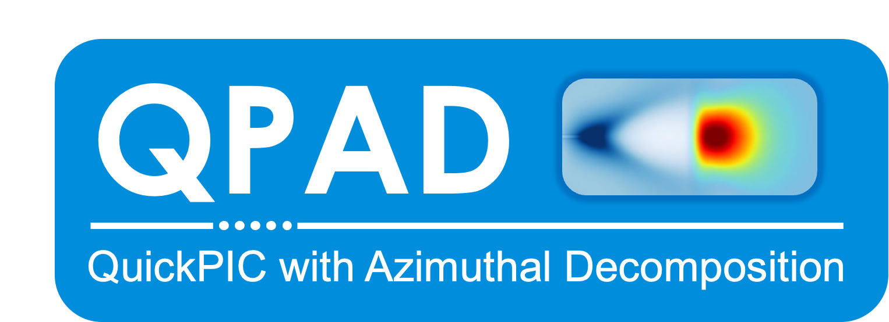
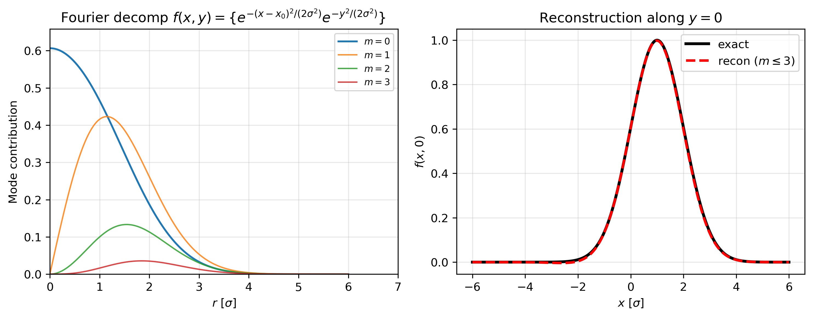
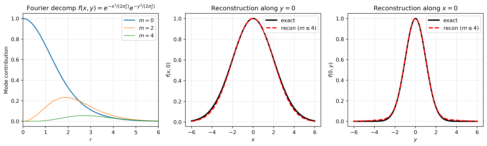

Validity of the Different Codes
===============================

.. warning::

    This section is under construction.

    This section will describe the domain of validity of the various codes:

    - Various approximations made (e.g., RZ, quasistatic, etc.)
    - Which physics is captured (e.g., ion motion? hosing? Coulomb scattering? betatron losses? self-injection?)

    This section is in-progress.
    Please `contribute here <https://github.com/10TeV-wakefield-collider/simulation_guide>`__.

QPAD 
----------------------

Quasi-3D, Quasi-static Algorithm
~~~~~~~~~~~~~~

QPAD is a particle-in-cell (PIC) code that combines the quasi-3D algorithm and quasi-static approximation to efficiently model plasma-based accelerators. In the quasi-3D algorithm, the fields and source terms are decomposed into azimuthal Fourier modes using a cylindrical geometry:

.. math::
   \begin{aligned}
   U(r,\phi,z) &= U^0(r,z) + 2\left[\sum_{m=1}^{\infty} \Re\{U^m\}\cos(m\phi)\right] \\
              &\quad - 2\left[\sum_{m=1}^{\infty} \Im\{U^m\}\sin(m\phi)\right]
   \end{aligned}

where :math:`U` represents an arbitrary scalar or vector field and :math:`U^m` represents the complex amplitude of each mode :math:`m`. Each scalar and field quantity is therefore represented by :math:`\boldsymbol{2m+1}` grids, one for the axisymmetric mode :math:`(m=0)` and two for the real and imaginary components of higher modes :math:`(m\geq1)`. For problems with small or moderate asymmetries, the fourier expansion can be truncated after a few terms (e.g. :math:`m\leq3`). 

QPAD also employs the quasi-static approximation which assumes that a laser or particle beam driver evolves over length scales much greater than the plasma response period, :math:`2\pi/k_p`. Under this approximation, the fields and sources can be represented by the coordinates :math:`(x,y,\xi = ct-z, s = z)` where :math:`\partial_s \ll \partial_{\xi}`. Combining the quasi-3D and quasi-static algorithms yields a set of equations governing equations for each fourier mode `m`:

.. math::
    \Delta_m \psi^m &= -(\rho^m - J_z^m),\\
    \Delta_m E_z^m &= \frac{1}{r} \frac{\partial}{\partial r}(rJ_{r}^m) + \frac{im}{r} J_{\phi}^m,\\ 
    \Delta_m B_r^m - \frac{B_r^m}{r^2} - \frac{2im}{r^2}B_{\phi}^m &= -\frac{\partial J_{\phi}^m}{\partial\xi} -\frac{im}{r}J_z^m, \\
    \Delta_m B_{\phi}^m - \frac{B_{\phi}^m}{r^2} + \frac{2im}{r^2}B_r^m &= \frac{\partial J_r^m}{\partial\xi} + \frac{\partial J_z^m}{\partial r},\\
    \Delta_m B_z^m &= -\frac{1}{r} \frac{\partial}{\partial r}(rJ_{\phi}^m) + \frac{im}{r} J_r^m, \\

where :math:`\Delta_m \equiv \frac{1}{r}\frac{\partial}{\partial r}(r\frac{\partial}{\partial r}) - \frac{m^2}{r^2}`. These Poisson-like equations are solved by depositing the fourier harmonics of the currents. The fourier modes of the electromagnetic fields are then interpolated to the particle positons and combined to push them. 

.. container:: float-figure

   .. image:: qpad_images/q3d_geometry.png
      :width: 65%
      :alt: Quasi-static grid

   .. rubric:: **Figure 1.** Quasi-3D grid geometry and particle layout.

While the fields are represented by a set of 2D cylindrical grids, the macroparticles can move in three-dimensional space as shown by Figure 1. Generally, macroparticles (e.g. beam or plasma particles) are distributed uniformly along the :math:`r,\phi,z` directions. To resolve the plasma response for a given mode :math:`m`, it is highly recommended simulations use a sufficient number of particles per cell along the azimuthal direction  :math:`ppc_{\phi}\geq 8m`. 

.. note:: 
   **On resolving higher fourier harmonics**

   Use enough azimuthal particles to resolve the highest mode :math:`\boldsymbol{m}`. As a rule-of-thumb, using :math:`\boldsymbol{ppc_{\phi} \geq 8m}` is recommended 

Approximations
~~~~~~~~~~~~~~

.. note:: 
    **Quasi-static validity**

    For particle beams evolving over betatron wavelengths, the quasi-static approximation is valid for high energies :math:`\boldsymbol{\gamma_b \gg 1}`. 

    For lasers evolving over Rayleigh lengths, the quasi-static approximation is valid when the laser frequency is much greater than the plasma frequency :math:`\boldsymbol{\omega_0/\omega_p \gg 1}`.

    **Quasi-3D validity**

    The quasi-3D algorithm is extremely efficient for simulating PWFA physics with moderate or small azimuthal asymmetries, for example, with beam misalignment of flat beams. In these cases, the Fourier mode expansion is highly converged within the first few modes :math:`\boldsymbol{m\leq 4}` when (1) the beam offset is comparable to its spot size :math:`\boldsymbol{x_0 \sim \sigma}` or (2) the aspect ratio of the beam is :math:`\boldsymbol{\sigma_x/\sigma_y \sim 2}`. The Fourier mode truncation reduces the algorithmic complexity to that of a 2D code while still resolving asymmetric 3D physics

    

Transverse Offsets and Hosing
~~~~~~~~~~~~~~

Due to its quasi-3D algorithm, QPAD can self-consistently model the hosing instability in a plasma wakefield accelerator with transverse misalignment between the driver and witness bunch.  For a witness bunch with a transverse offset :math:`x_0` w.r.t the driver, the density profile is given by:

.. math::
    n_b = \exp \bigg(-\frac{(x-x_0)^2}{2\sigma^2}\bigg) \exp \bigg(-\frac{y^2}{2\sigma^2}\bigg)

where :math:`x,y` are the transverse coordinates and :math:`\sigma` is the spot size. The fourier mode decomposition of this profile is 

.. math::
    n_b = \exp\left(-\frac{(x^2 + x_0^2)}{2\sigma^2}\right) \bigg[I_0(\alpha) + 2 \sum_{m=1}^{\infty} I_n(\alpha) \cos(m\phi)\bigg]

where :math:`\alpha \equiv \left(\frac{x_0}{\sigma} \frac{r}{\sigma}\right)`, and :math:`I_m(\alpha) \equiv \int_0^{2\pi} \exp\left[-\alpha cos(\phi)\right]\cos(m\phi)` are the Bessel functions of the first kind of order :math:`m`.

Figure 2 shows the  dropoff in the azimuthal fourier mode contributions for a bi-gaussian with an offset equal to its spot size :math:`x_0 = \sigma`. The Bessel functions :math:`I_m` drop off quickly with increasing mode number :math:`m` allowing an early truncation of the mode expansion. The beam profile reconstruction (black) along the :math:`\hat{x}`-direction with the azimuthal expansion truncated at :math:`m \leq 3` shows good agreement with the exact beam profile (red). See the :doc:`QPAD single-stage example <../example_simulations/single_stage/qpad>` to run an beam-driven PWFA simulation with hosing.

  **Figure 2.** (Left) Fourier decomposition of bi-Gaussian with an offset :math:`x_0=\sigma`. (Right) Comparison of recontruction (:math:`m \leq 3`) with exact profile.

.. note:: 
    **Azimuthal Mode Truncation for Offsets**

    The fourier mode expansion is well-converged within the first few modes :math:`\boldsymbol{m \leq 3}` when the witness bunch offset is on the order of its spot size :math:`\boldsymbol{x_0 \lesssim \sigma}`.

    Increasing the number of modes for larger offests :math:`\boldsymbol{x_0 \gg \sigma}` is recommended to achieve numerical convergence.

Flat Beams
~~~~~~~~~~~~~~

The quasi-3D algorithm also enables self-consistent modeling of flat beams and their effects on the plasma wake excitation. For a flat beam, the density profile is given by:

.. math::
    n_b = \exp \bigg(-\frac{x^2}{2\sigma_x^2}\bigg) \exp \bigg(-\frac{y^2}{2\sigma_y^2}\bigg)

where :math:`x,y` are the transverse coordinates and :math:`\sigma_x,\sigma_y` is the spot sizes, respectively. The fourier mode decomposition of this profile is 

.. math::
    n_b = \exp \left(-\frac{r^2}{4} \bigg(\frac{1}{\sigma_x^2} + \frac{1}{\sigma_y^2}\bigg) \right) \bigg[I_0(\alpha) + 2 \sum_{m=1}^{\infty} I_n(\alpha) \cos(2m\phi)\bigg]

where :math:`\alpha = \frac{r^2}{4\sigma_x^2} \left( \frac{\sigma_x^2}{\sigma_y^2} - 1 \right)` and :math:`I_m(\alpha)` are Bessel functions of the first kind. It is worth noting that the odd Fourier modes vanish, so it is generally recommended to truncate the expansion on an even mode number :math:`m=0,2,4...`. 

Figure 3 shows the azimuthal fourier mode contributions for a asymmetric bunch with :math:`\sigma_x =2, \sigma_y =1` (arbitrary units). Higher order harmonics drop off rapidly within the first few modes :math:`m \leq 4` for an aspect ratio of :math:`\eta \equiv \sigma_x/\sigma_y =2`. The beam reconstructions agree well with the exact profile along each plane. 

  **Figure 3.** (Left) Fourier decomposition of bi-Gaussian with asymmetric spots with :math:`\sigma_x = 2, \sigma_y = 1` for modes up to :math:`m=4`. Comparison of fourier mode reconstruction with exact profile along :math:`y=0` (Middle) and :math:`x=0` (Right).

.. note:: 
    **Azimuthal Mode Truncation for Flat Beams**

    The fourier mode expansion is well-converged after the first few modes :math:`\boldsymbol{m \lesssim 4}` for flat beams with aspect ratios of :math:`\boldsymbol{\sigma_x/\sigma_y \lesssim 2}`.

    Based on experience, it is generally recommended to scale the mode number with the aspect ratio for more elliptically shaped beams.

Self-Injection
~~~~~~~~~~~~~~

QPAD does not support capabilities for modeling self-injection due to its quasi-static algorithm.

Betatron Losses
~~~~~~~~~~~~~~

TBD

Coulomb Collisions
~~~~~~~~~~~~~~

TBD

HiPACE++
----------------------

3D Quasi-static Algorithm
~~~~~~~~~~~~~~

Approximations
~~~~~~~~~~~~~~

.. note:: 
    **Quasi-static validity**

    For particle beams evolving over betatron wavelengths, the quasi-static approximation is valid for high energy :math:`\boldsymbol{\gamma_b \gg 1}`. 

    For lasers evolving over Rayleigh lengths, the quasi-static approximation is valid when the laser frequency is much greater than the plasma frequency :math:`\boldsymbol{\omega_0/\omega_p \gg 1}`.

Hosing and Flat Beams
~~~~~~~~~~~~~~

Due to its full-3D algorithm, HiPACE++ can model beams with arbitrary offsets and spot size asymmetries...

Self-Injection
~~~~~~~~~~~~~~

HiPACE++ does not support capabilities for modeling self-injection due to its quasi-static algorithm...

Betatron Losses
~~~~~~~~~~~~~~

TBD

Coulomb Collisions
~~~~~~~~~~~~~~

TBD

Wake-T
----------------------

Quasi-static Algorithm
~~~~~~~~~~~~~~

Approximations
~~~~~~~~~~~~~~

.. note:: 
    **Quasi-static validity**

    For particle beams evolving over betatron wavelengths, the quasi-static approximation is valid for high energy :math:`\boldsymbol{\gamma_b \gg 1}`. 

    For lasers evolving over Rayleigh lengths, the quasi-static approximation is valid when the laser frequency is much greater than the plasma frequency :math:`\boldsymbol{\omega_0/\omega_p \gg 1}`.

Hosing and Flat Beams
~~~~~~~~~~~~~~

TBD

Self-Injection
~~~~~~~~~~~~~~

Wake-T does not support capabilities for modeling self-injection due to its quasi-static algorithm.

Betatron Losses
~~~~~~~~~~~~~~

TBD

Coulomb Collisions
~~~~~~~~~~~~~~

TBD

